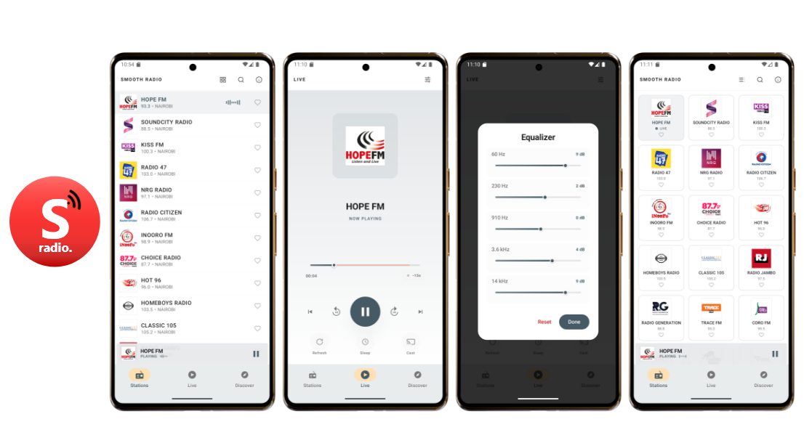

# 📻 Smooth Radio: 200+ Kenyan FM Radio Stations

  

  

*A premium radio experience featuring 200+ Kenyan FM stations, used by over 100,000 listeners worldwide.*

---

## 📱 Download

**100,000+ downloads** • Rated 4.5★

---

## 🌟 Modern Features

- **🕒 Time Machine:** The only Kenyan radio app that lets you **rewind, seek, and pause live radio**. Never miss a moment.
- **🎵 Pro Equalizer:** Fine-tune your listening experience with a built-in 5-band equalizer and bass boost.
- **🚀 Ultra-Fast Loading:** Optimized HD audio engine with local proxy technology for near-instant playback and reduced data usage.
- **🎨 Material 3 UI:** A beautiful, modern interface with **Full Dark & Light Mode** support and dynamic colors.
- **📱 Adaptive Layouts:** Optimized for all form factors, from compact phones to **tablets and foldables**.
- **🔀 Flexible Browsing:** Instantly toggle between **Grid and List views** to find your favorite stations.
- **📺 Google Cast:** Effortlessly stream your radio to TVs and smart speakers with integrated Cast support.
- **📊 Smart Discovery:** Find stations by genre, region, or popularity with real-time metadata (Artist & Song titles).
- **🔋 Background & Data Saving:** Advanced background playback with an intelligent timeout to save battery and data.
- **⭐ Favorites & Sleep Timer:** Personalized quick-access list and a smart sleep timer for bedtime listening.

## 🛠️ Technical Stack

- **UI:** 100% **Jetpack Compose** with Material 3 and adaptive layout support.
- **Media Engine:** **Android Media3 & ExoPlayer** with Google Cast integration.
- **Concurrency:** **Kotlin Coroutines & Flow (StateFlow/SharedFlow)** for reactive, lifecycle-aware state management.
- **Architecture:** **MVVM + Clean Architecture** (UseCases) for a scalable and testable codebase.
- **Dependency Injection:** **Hilt (Dagger)** for modular and clean DI.
- **Streaming Engine:** Custom-built **Local Audio Proxy** for rolling-buffer disk caching and bitrate estimation.
- **Persistence:** **Room Database** for station caching and **DataStore** for user preferences.
- **Networking:** **OkHttp & Retrofit** for reliable API communication.

## 📝 Project Evolution

*Note: This project has a long development history dating back to 2018. Over its lifetime, it has evolved from a simple Java/XML app to a modern, production-grade Kotlin/Compose application. While this repository reflects the current state-of-the-art codebase, the app has served over 100,000 users with a focus on high-performance audio engineering and intuitive user experience.*
